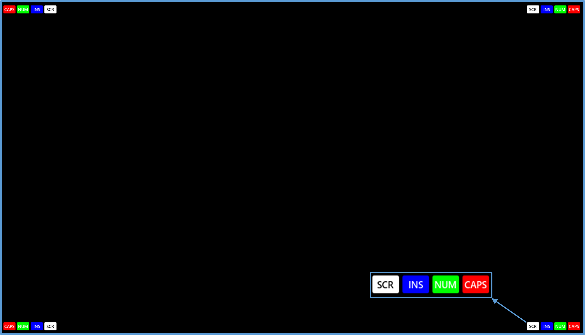
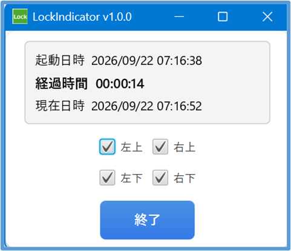

# LockIndicator — Caps / Num / Insert / Scroll インジケータ

**LockIndicator** は、Caps / Num / Insert / Scroll の各キー状態を Windows API から取得し、  
**すべてのモニターの四隅に小型インジケータとして常時表示する JavaFX アプリ**です。  
インジケータの **配置場所の選択** や **色設定** に対応し、作業を妨げない軽量な常駐ツールとして利用できます。  
 
# 🎯 特徴

- **Caps / Num / Insert / Scroll の ON/OFF をリアルタイム表示**  
  Windows API の `GetKeyState()` を用いて、キー状態を確実に取得します。  

- **複数モニター対応**  
  すべてのモニターに対して独立した透明 JavaFX Stage を生成し、同時表示します。  

- **表示位置を四隅から選択可能**  
  左上 / 右上 / 左下 / 右下 の中から、設定ウィンドウで簡単に切り替えできます。  

- **色設定を config.json で変更可能**  
  Caps / Num / Insert / Scroll の各インジケータごとに、背景色・文字色を自由にカスタマイズできます。  

- **マウス操作を完全透過化**  
  インジケータはクリックを一切奪わず、通常の作業を妨げません。  

# 🖥️ 動作環境

- **Windows 10 / 11**  
- **インストール不要**  
- **ZIP展開のみ**  
- **レジストリ未使用**  

# 📥 ダウンロード

最新版はこちらからダウンロードできます。

👉 https://github.com/takeo-2026/LockIndicator-Release/releases/latest

# 📸 スクリーンショット

### **画面四隅にインジケータを表示した例**  
各モニターの四隅に、Caps / Num / Insert / Scroll の状態がリアルタイムで表示されます。



### **表示位置を選択する設定ウィンドウ**  
チェックボックスで、左上 / 右上 / 左下 / 右下 の表示位置を切り替えられます。



# ▶️ 使い方 — 

1. ZIP を展開  
2. `config.json` を必要に応じて編集  
3. `LockIndicator.exe` を起動  
4. 設定ウィンドウで表示位置を選択  
5. 画面四隅にインジケータが表示されます

# 🧭 補足説明

## 📄 config.json について  
本アプリでは、各インジゲータ（CapsLock / NumLock / Insert / ScrollLock）の  
**背景色（BgColor）** と **文字色（FgColor）** を設定できます。

設定ファイル *config.json* は以下の形式です。

```json
{
  "scrBgColor":  "#FFFFFF",
  "scrFgColor":  "#000000",

  "insBgColor":  "#0000FF",
  "insFgColor":  "#FFFFFF",

  "numBgColor":  "#00FF00",
  "numFgColor":  "#FFFFFF",

  "capsBgColor": "#FF0000",
  "capsFgColor": "#FFFFFF"
}
```

## 🎨 各項目の意味  
- **xxBgColor**  
  インジゲータの背景色（背景の円や矩形の色）

- **xxFgColor**  
  インジゲータ内の文字色（INS / NUM / CAPS などの文字）

## 🖍 色指定について  
色は **#RRGGBB 形式の16進カラーコード** で指定します。  
例：  
- 白 → `#FFFFFF`  
- 黒 → `#000000`  
- 赤 → `#FF0000`  
- 緑 → `#00FF00`  
- 青 → `#0000FF`

## 🔧 インジゲータと設定項目の対応  
| インジゲータ | 背景色キー | 文字色キー |
|--------------|------------|------------|
| ScrollLock   | scrBgColor | scrFgColor |
| Insert       | insBgColor | insFgColor |
| NumLock      | numBgColor | numFgColor |
| CapsLock     | capsBgColor| capsFgColor |


# 📄 ライセンス

本ソフトウェアは **無保証** で提供されます。  
詳細は同梱の LICENSE をご確認ください。

# ⚠️ 免責事項

本ソフトウェアは **無保証** で提供されます。  
詳細は同梱の LICENSE をご確認ください。

# 🤝 貢献

Pull Request / Issue 大歓迎です。  
Issues / PR 歓迎します（個人開発のため対応はゆるやかです）。

# 📘 関連記事

LockIndicatorの開発経緯や実装方法については、Qiitaで公開しています。  

Qiita https://qiita.com/pgb01471/items/f236175ab4e6cc85943b

# 👤 作者

Takeo Saito  
👉 https://github.com/takeo-2026?utm_source=copilot.com
